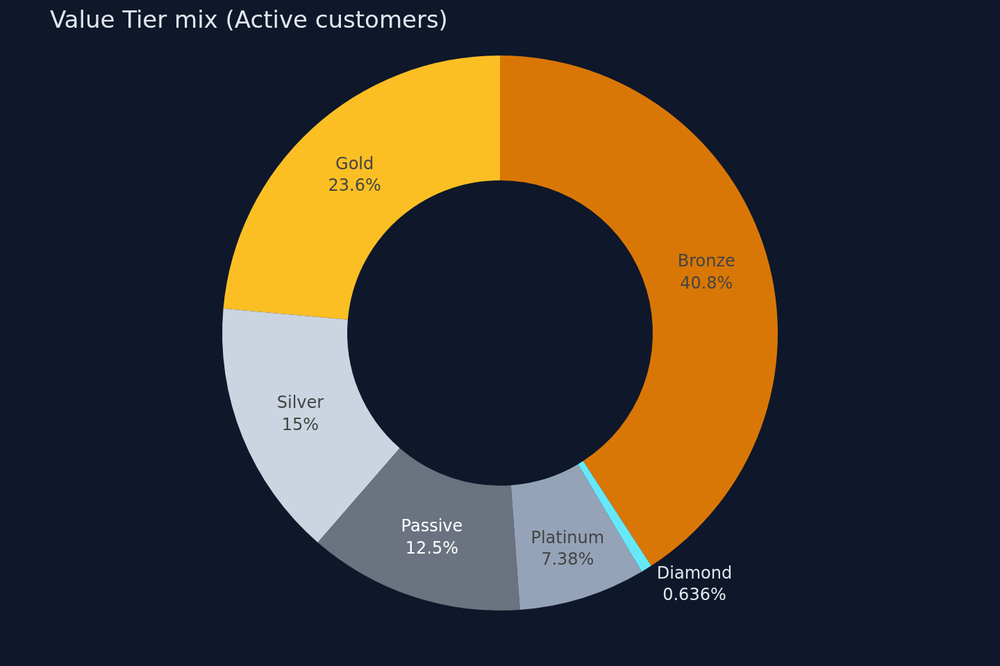
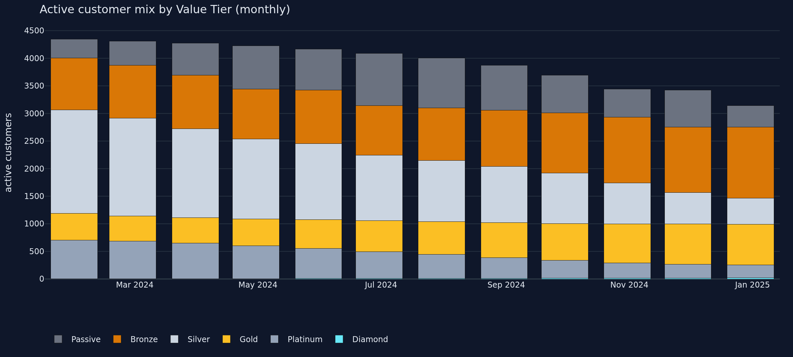
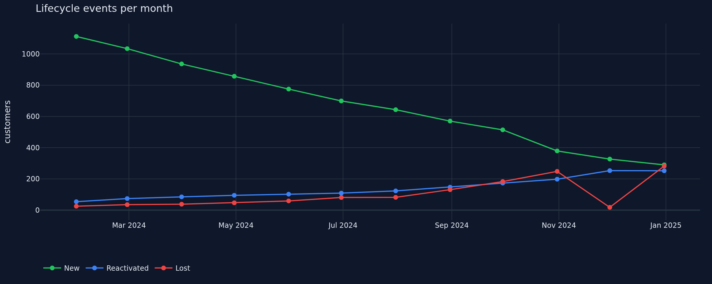

# CRM Analytics System

> **Live demo:** [scripts-and-tables.github.io/crm-analytics-system](https://scripts-and-tables.github.io/crm-analytics-system) *(after enabling GitHub Pages on this repo, source = `docs/`)*

End-to-end **CRM analytics showcase**: synthetic data generator → SQL calculation pipeline → static dashboard published on GitHub Pages. The dashboard demonstrates an RFMT-based customer-segmentation system in a way recruiters and peers can open with a single click — no `pip install`, no server.

All data is synthetic and fully reproducible from a seeded Python script.

---

## What's in this repo

* a documented business-logic specification (`docs/specs/crm_calculation_logic.md`)
* a SQLite schema and a single-month CRM calculation in plain SQL
* a multi-month build orchestrator that produces a per-customer × per-month snapshot
* a persona-driven synthetic-data generator (every CRM segment / lifecycle event populated by construction)
* a static HTML + Plotly.js dashboard (filters, drill-down table, CSV export) served from `docs/` via GitHub Pages
* a build script that exports the snapshot as JSON for the dashboard and as PNG screenshots for the README

---

## Screenshots







---

## Core Analytics Concepts (Summary)

* **Consumables drive CRM** — engagement is measured using recurring `consumable` products. `device`, `accessories`, and `spare_parts` purchases are excluded from engagement metrics; the only device-based KPI is `first_device_purchase_date`.
* **Three independent customer outputs per month**
  * **Activity Status** — Active (`M12 > 0`) / Not Active.
  * **Value Tier** — `Passive` (silent ≥6 months) overrides, then `Diamond → Platinum → Gold → Silver → Bronze` based on Average Monthly Consumption (AMC), Average Order Size (AOS), and orders in last 6 months (O6).
  * **Lifecycle Event** — `New`, `Lost`, or `Reactivated` in the report month.
* **RFMT-based value tiering** — Diamond and Platinum exercise Recency, Frequency and Monetary (volume) jointly; Tenure is captured as `tenure_months` for cohort analysis.

Full details in [`docs/specs/crm_calculation_logic.md`](docs/specs/crm_calculation_logic.md).

---

## Repo Layout

```
.
├── docs/                              ← GitHub Pages root (source = docs/)
│   ├── index.html                     showcase landing page (Plotly.js + vanilla JS)
│   ├── data.json                      generated CRM snapshot for the JS to consume
│   ├── assets/{css,js}/               page styles and client-side app
│   ├── screenshots/                   PNG previews used in README
│   └── specs/                         markdown specs (rendered to .html alongside)
│       ├── crm_calculation_logic.md   KPI + segmentation rules (source of truth)
│       ├── source_files_specifications.md
│       └── project_requirements.md
├── db/
│   ├── schema.sql                     raw_* table DDL (SQLite)
│   ├── run_crm_calculation.sql        single-month CRM calc (parameterised in tt_params)
│   └── build.py                       multi-month build orchestrator
├── scripts/
│   ├── build_report.py                SQLite → docs/data.json + screenshots + spec HTML
│   └── generate_data/
│       ├── generate.py                seeded synthetic CSV generator
│       ├── verify.py                  smoke-test: load → calc → print distribution
│       └── requirements.txt
├── CLAUDE.md                          project guide for AI assistants
└── data/input/                        CSVs + crm.db (gitignored, rebuild locally)
```

---

## How to Run (locally rebuild everything)

```bash
# 1. Install Python dependencies
pip install -r scripts/generate_data/requirements.txt
pip install plotly kaleido jinja2 markdown            # for the report builder
yes | kaleido_get_chrome                              # one-off: PNG export needs headless Chrome

# 2. Generate the synthetic CSVs in data/input/
python scripts/generate_data/generate.py

# 3. Build the SQLite database (schema + load CSVs + 12-month CRM snapshot)
python db/build.py

# 4. (Optional) Verify the dataset exercises every CRM segment / event
python scripts/generate_data/verify.py

# 5. Build the static site (writes docs/data.json, docs/screenshots/, docs/specs/*.html)
python scripts/build_report.py

# 6. (Optional) Open the page locally
python -m http.server -d docs 8000
# then open http://localhost:8000
```

---

## Deploying to GitHub Pages

After pushing to GitHub, in the repo settings → Pages:

1. **Source**: Deploy from a branch
2. **Branch**: `main` (or whichever default), **folder**: `/docs`
3. Save. The site will be served at `https://<owner>.github.io/<repo>/`.

GitHub Pages reads everything in `docs/` as-is (Jekyll is disabled via the `docs/.nojekyll` marker). The committed `docs/data.json` and `docs/screenshots/` are what the site actually serves — re-run `python scripts/build_report.py` and commit the regenerated artifacts whenever the underlying data or business logic changes.

---

## Methodological Background

Inspired by established CRM and customer analytics practices used in FMCG and retail. RFM/RFMT segmentation is a transparent, business-interpretable alternative to black-box models. More about RFM on [Wikipedia](https://en.wikipedia.org/wiki/RFM_(market_research)).

---

## Limitations

* Fully synthetic dataset.
* Predictive modelling intentionally out of scope.
* Master data treated as point-in-time snapshots.

---

## Potential Extensions

* Churn and reactivation modelling
* Customer lifetime value forecasting
* Promotion and uplift analysis
* GitHub Action that rebuilds `docs/` on every push to `main`

---

## License

MIT. Reference implementation; not for production use.
